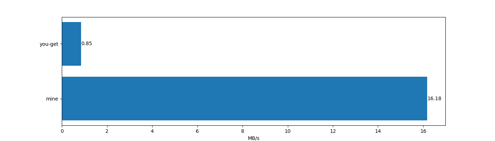

# AsyncBilibiliDownloader
异步bilibili下载器，支持下载视频和番剧，基于`aiohttp`和`asyncio`的协程下载，速度飞快～

### 特点
- 轻量级，简单易用，只使用一个线程，开销很小。
- 使用协程同时从多个源下载（b站几乎所有视频都有至少一个备用源），速度很快，基本上能把带宽拉满。
- 使用异步方式写文件，下载速度几乎不受磁盘读写速度影响。

### 测速
我的网络带宽大约为150Mbps，下图为测速结果：

使用you-get和本下载器（`max_tasks`为20，`chunk_size`为500KB, `timeout`为10秒）下载视频[【敖厂长】1989年日本最早生存恐怖游戏 真的很恐怖吗?](https://www.bilibili.com/video/av89685634)（121.02MB）的速度对比图如下：

两者差距非常大，本下载器下载速度是you-get的19倍多。

### 使用
- 如果下载视频，需实例化`VideoDownloader`类；如果下载番剧，需实例化`BangumiDownloader`类。
- 调用`run`方法即可开始下载。

### 参数
- `aid`: 视频av号。
- `ep_id`: 番剧单集编号。
- `quality`: 视频质量。可选值为：112/116、74、80、64、32、16分，分别对应1080P+、720P+、1080P、720P、480P、360P。
- `fname`: 保存文件名，格式为flv。
- `max_tasks`: 协程数。
- `chunk_size`: 单个协程下载的视频大小，单位字节。
- `sess_data`: 用户Cookies中的SESSDATA，对于需要大会员才能观看的视频必须传入大会员的SESSDATA。
- `timeout`: 单个协程下载的时间限制，超出将重试。

### 说明
- `max_tasks`和`chunk_size`均不宜设置过大。建议设置两者的乘积为网络带宽大小（单位字节）。
- 如果带宽无限大，理论上协程数加倍能使得下载速度加倍。但是带宽有限，协程数达到一定值下载速度趋于稳定。
- 建议使用Python3.6版本，Python3.7版本中有bug，可能会导致`aiohttp`中SSL验证失败，详见[https://github.com/aio-libs/aiohttp/issues/3535](https://github.com/aio-libs/aiohttp/issues/3535)。目前我也不太清楚如何修复……